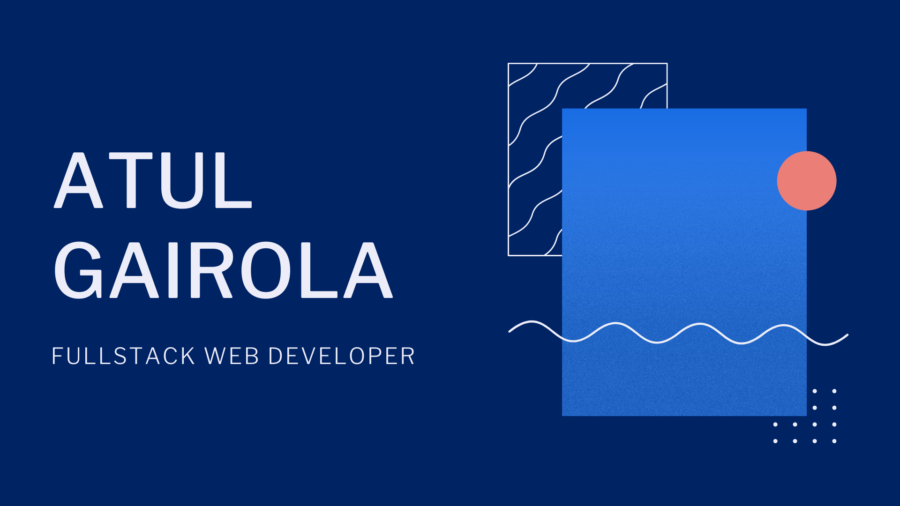

# Hey there 👋 
I am Atul Gairola, a MERN stack web developer and designer from India. 
I am currently working as a Fullstack web dev intern  and also taking freelance works :computer:, while pursuing my Btech in Computer Science :mortar_board:.

I believe in the philosophy that 
> "one can never learn everything, but there is nothing one cannot learn."

Thus I am passionate about challenging myself to learn more and create more everyday. 

When I am not developing you can find me watching anime or surfing through youtube falling trap to clickbaits. I like watching documentaries on space and wildlife and am starting to try reading as a hobby.

***

 
 

 
  
 

